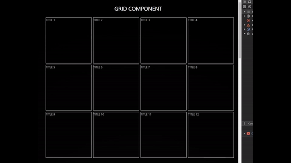

# React Grid Component By Me



Create a very cool website, that is made out of grid cells. When a user touches the cell it gets bigger 😳.

Style, size and content of these cells are easily customizable 👍.

## Install

```
npm i aex-grid-component
```

## Usage

```tsx
<Grid
    // styles for the grid cells.
    itemClassName="border"
    // how many max columns can this grid have, min is 3
    numberOfColumns={4}
    // width and height of a cell in px
    itemWidth={250}
    itemHeight={250}
    // gap in px between the cells
    gap={8}
>
    <GridItem
        thumbnail={<h1>Component when the cell is NOT expanded</h1>}
        content={<h1>Component when the cell IS expanded</h1>}
        spanCols={3} // how big should this cell become onClick
        spanRows={4}
    />
    // ...add more GridItems
</Grid>
```

Grid itself has no styles, it is always centered in the window, transparent and resizes automatically.

If GridItem is too big for the grid it will expand downwards to compensate the width.

numberOfColumns is min 3, because 2 is reserved for phones. When grid is 2 cols wide, GridItems will always be 50% wide. It looks better that way 😉.
